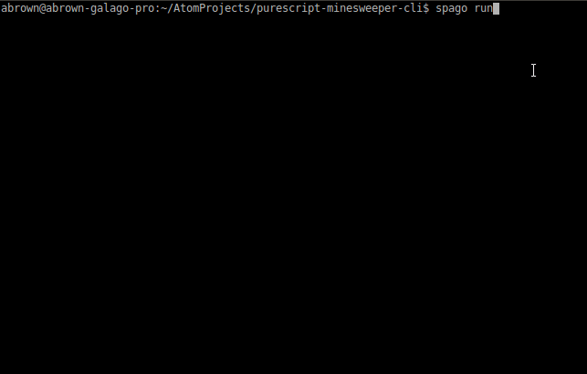

# Purescript Minesweeper CLI

This is a sample Purescript project implementing Minesweeper in the NodeJS CLI.

## Prerequisites

Ensure you have [`node`, `npm`](https://github.com/nvm-sh/nvm/blob/master/README.md), [`purescript`, and `spago`](https://github.com/purescript/documentation/blob/master/guides/Getting-Started.md) installed.

## Building the Project

Simply run `spago build` from the main project directory, or use `spago bundle-app` to bundle into a single index.js.

## Running the Game

Run `spago run` from the main project directory, or use `node .` if you've bundled the app instead. Use the `node . --help` option to see the program options.

## Design Goals and Philosophy

I wrote this project for some practice with Purescript, and to learn how to build a CLI in Purescript. There is nothing too fancy in the design aside from using the `Aff` monad.

It is well known that a lot of (if not maybe all?) [UIs](https://www.youtube.com/watch?v=EoJ9xnzG76M) (especially [games](https://javran.github.io/posts/2014-08-22-comonad-zipper-and-conways-game-of-life.html)) can be implemented as comonads. I'm almost certain Minesweeper could be elegantly implemented as a Comonad/Zipper, but I did not take the thought and effort to do so on this first version. This first version is a fairly naive and direct approach. I'd be very interested in seeing a Comonad/Zipper approach in the future though.

I can't speak for how idiomatically this project is structured since I've never worked on a Purescript CLI before, much less on a team. Feedback and/or contribution is welcome in this regard.

## Contributing

Contributions are welcome! Just send a pull request or file an issue.
